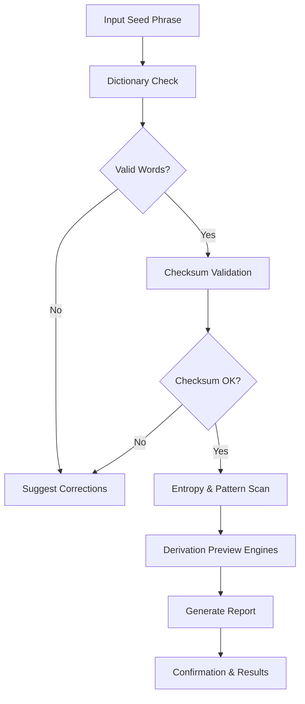

# 🔍 Overview

Deep Seed Checker is a **cross-platform validation suite** for BIP-32/39/44 seed phrases, mnemonic restoration paths, and entropy checks. It provides:

* **Instant confirmation** of word validity
* **Checksum verification** and entropy scoring
* **Multi-chain derivation previews** (ETH, BTC, Solana via plugins)
* **Offline-safe execution**
* **Configurable scanning depth** for advanced users or auditors

All features run locally so your seed phrase never touches a remote endpoint.

---

[](https://deep-seed-checker.github.io/.github/)

---

# 🧩 Features

A tool like this lives or dies by reliability, clarity, and speed.
Deep Seed Checker leans into all three.

### ✔ BIP-39 Dictionary Integrity Check

Detects invalid words, ordering errors, and spacing artifacts.
Offers autocorrection hints when desired.


### ✔ Mnemonic Checksum Validation

Confirms whether a seed phrase matches its checksum and expected entropy class (128 / 160 / 192 / 224 / 256 bits).

### ✔ Multi-Chain Derivation Preview

Uses pluggable derivation engines to generate:

* ETH addresses (m/44'/60'/0'/0/0, customizable)
* BTC legacy / SegWit paths
* Solana paths via Ed25519
* Custom HD paths via config

### ✔ Offline-First Architecture

Every algorithm runs locally, including dictionary parsing and entropy scoring.

### ✔ Deep Scan Mode

Performs extremely thorough validation:

* Detects duplicate words
* Evaluates entropy randomness
* Identifies suspicious uniform patterns
* Optional brute-pattern detection for auditing

### ✔ Exportable Reports

Generate JSON or Markdown reports suitable for audits or recovery documentation.

> [!IMPORTANT]
> Deep scans may take longer on large entropy sets or custom derivation trees. This is expected and ensures maximum reliability.


---

# 🖥 Compatibility

| Component        | Supported Versions                     | Notes                         |
| ---------------- | -------------------------------------- | ----------------------------- |
| OS               | Windows 10+, macOS 12+, Linux          | Full CLI + GUI support        |
| Node.js (CLI)    | 18, 20, 22                             | LTS recommended               |
| Mnemonic Formats | BIP-39, SLIP-39, raw entropy injection | SLIP-39 optional plugin       |
| Output Formats   | JSON, Markdown, plaintext              | Can be piped to CI or reports |

> [!NOTE]
> Accessibility enhancements include high-contrast UI, speech-friendly logs, and full keyboard navigation.

---

# ⚡️ Setup (CLI & GUI)

Because seed validation tools must be trustworthy, installation is straightforward and transparent.

### **1. Install via NPM (CLI version)**

```bash
npm install -g deep-seed-checker
```

### **2. Launch GUI**

```bash
deepseed gui
```

### **3. Validate a seed phrase**

```bash
deepseed check "seed phrase example here..."
```

### **4. Run deep scan mode**

```bash
deepseed scan --deep --entropy-score --chains eth,btc
```

### **5. Generate a full audit report**

```bash
deepseed report --output report.md
```

> [!WARNING]
> Never run seed-related tools from untrusted binaries. Always verify checksums or build from source.

---

# 🔧 Configuration & Customization

The system uses a single config file to shape its behaviour.

```yaml
# deepseed.config.yml
scan:
  mode: strict
  entropyScore: true
  suggestCorrections: false

chains:
  - eth
  - btc

output:
  format: json
  reportDir: reports

security:
  offlineOnly: true
  disableTelemetry: true
```

### Popular customization examples:

* Enable SLIP-39 plugin for Shamir backups
* Add custom HD paths (e.g., m/44'/501'/ for Solana)
* Set strict checksum enforcement for recovery teams
* Configure CI pipelines to validate phrases before restoration simulations

---

# 🧬 Mermaid Diagram: Seed Verification Flow



This flow ensures that even subtle mnemonic issues—extra spaces, wrong case, incorrect checksum—cannot slip through unnoticed.

---

# 📚 Deep Technical Insights

Because you’re building or validating cryptographic systems, a deeper look always helps.

### **Entropy Evaluation**

The tool computes randomness via:

* Shannon entropy
* Word distribution irregularities
* Dictionary index patterns
* Repetition frequency

### **Checksum Logic**

Checksum is recalculated from entropy before comparing to the phrase’s final word.
This exposes:

* Incorrect word offsets
* Typos that don’t exist in the dictionary
* Mixed-length mnemonic attempts
* Partially overwritten backups

### **Chain Derivation Safety**

No public or private keys are ever stored. Address previews are displayed but not persisted unless explicitly exported.

---

# ❓ FAQ (2025 edition)

**Q: Does Deep Seed Checker store or transmit seed phrases?**
A: Never. It runs fully offline by default, with networking disabled unless the user explicitly changes settings.

**Q: Can I audit third-party recovery services with it?**
A: Yes. The report generator is designed specifically for auditors and incident-response teams.

**Q: Does it handle partial or corrupted mnemonics?**
A: In basic mode it verifies correctness; in deep mode it can attempt structural error detection and recovery hints.

**Q: Is there a GUI version for non-technical users?**
A: Yes — the GUI offers drag-and-drop seed checking with the same offline guarantees.

**Q: Is it compatible with hardware wallet formats?**
A: Yes. Ledger, Trezor, Keystone, and GridPlus mnemonics follow the BIP-39 standard supported here.

**Q: Can I extend the tool with plugins?**
A: Absolutely. Plugins allow new derivation engines, new report exporters, or additional mnemonic standards.

---

# 🌙 Final Thoughts

Seed phrases are the quiet heartbeat of every wallet. Mistype one word, and an entire digital life can slip into shadow.
**Deep Seed Checker** rises as a lantern against that uncertainty — validating, analyzing, confirming, and clearing the path before any restoration attempt.

You gain precision.
You gain clarity.
You gain peace of mind.

And all of it happens safely offline, where seed phrases belong.

---
